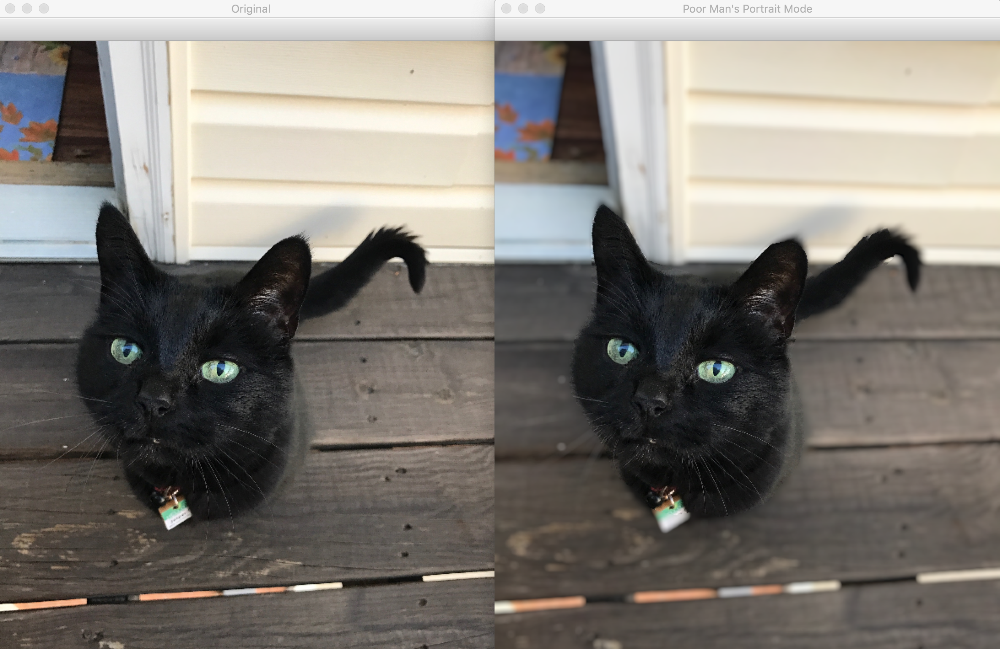

# Poor Man's Portrait Mode

> Inspired by [Computerphile](https://www.youtube.com/watch?v=vNG3ZAd8wCc)

Quickly thrown together imitation of iPhone's 'portrait mode'.  Made with Mask RCNN and a complex kernel lens blur.

Performance is... quite terrible on my local machine, but no need/desire to optimize.

### Example Output

<p align='center'>
  
</p>

### Process

* Run pre-trained COCO Mask RCNN (reference: [GluonCV](https://gluon-cv.mxnet.io/api/model_zoo.html#gluoncv.model_zoo.MaskRCNN)).
* Assume largest detected object mask is focal point.
* Apply lens blur everywhere but on largest detected object (reference: [Computerphile](https://github.com/mikepound/convolve))


### Example Usage

This is the code used to generate the above example output (found in file: [`apply_portrait_mode.py`](apply_portrait_mode.py)).

```python
import cv2
from portrait_mode import portrait_mode

IMAGE_PATH = 'images/jasper_deck.jpg'

# Run detection and blurring effects
portrait_mode_img, original_img = portrait_mode(IMAGE_PATH)

# Display results
cv2.imshow("Poor Man's Portrait Mode", portrait_mode_img)
cv2.imshow('Original', original_img)
cv2.waitKey(0)
```
